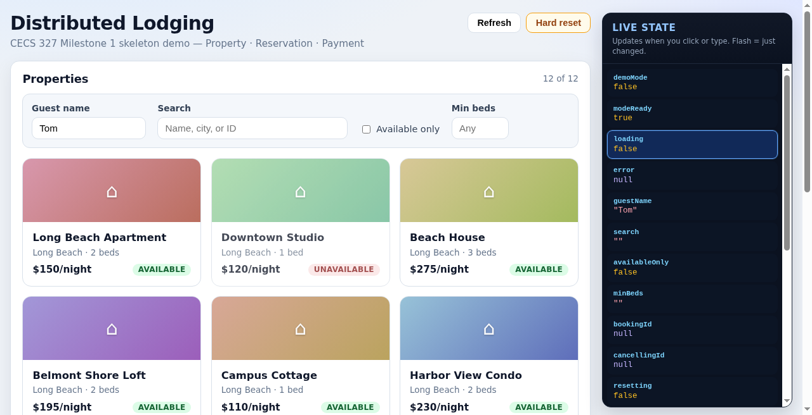

# CECS 327 Distributed Lodging

Milestone 1 project for CECS 327, Section 02 at California State University, Long Beach.

**Team:** Hailey Clark, Josiah Guzman, Cameron Hill, Wasik Islam, Andrew Trujillo, Tom Malter, and Anthony Torres

**Milestone 1 due:** September 24, 2026

## Live demo

Try the hosted Milestone 1 UI (Cloudflare Worker + D1):

| | |
|---|---|
| **Primary** | [https://lodging.pitchblack.icu](https://lodging.pitchblack.icu) |
| Apex | [https://pitchblack.icu](https://pitchblack.icu) |
| WWW | [https://www.pitchblack.icu](https://www.pitchblack.icu) |
| Workers.dev | [https://cecs327-lodging.tommalter5.workers.dev](https://cecs327-lodging.tommalter5.workers.dev) |

[](https://lodging.pitchblack.icu)

*Click the preview to open the live site. Features: search, property cards, book/cancel, hard reset (double confirm), colorized service logs, and a live React state panel.*

## Project

We are building a distributed lodging reservation system similar to Airbnb. Guests will be able to search properties and make reservations, while hosts will be able to create listings and manage availability.

For Milestone 1, we have three backend **Node.js HTTP** microservices plus an Express gateway and React UI (local demo), and a **Cloudflare Worker + D1** host for the same API contract:

- Property Service (HTTP `:5001` locally; D1 module on Cloudflare)
- Reservation Service (HTTP `:5002` locally; Worker module on Cloudflare)
- Payment Service (HTTP `:5003` locally; mock module on Cloudflare)
- HTTP Gateway (Express `:8000` locally; Hono Worker `cecs327-lodging` on Cloudflare)
- React frontend (Vite `:5173` locally; Workers Assets when hosted)

```text
React UI (:5173)
  -> Gateway Express (:8000)
       -> Property Service (:5001)
       -> Reservation Service (:5002)
            -> Property Service (HTTP)
            -> Payment Service (:5003)
            -> data/reservations.csv + data/properties.csv
```

> **Note:** The original Python TCP services are archived under `archive/python-tcp/`.
> Node.js HTTP is the current stack.

User Service and Review Service are planned for later milestones.

## Ports

| Component            | Port |
|----------------------|------|
| Property Service     | 5001 |
| Reservation Service  | 5002 |
| Payment Service      | 5003 |
| HTTP Gateway         | 8000 |
| React (Vite)         | 5173 |

## Repository Structure

```text
.
├── docs/
├── frontend/                 # React + Vite UI
├── services/                 # Local Node HTTP microservices
│   ├── shared/
│   ├── property-service/
│   ├── reservation-service/
│   ├── payment-service/
│   └── gateway/
├── cloudflare/               # Hosted Worker (Hono) + D1 + Assets
│   ├── src/
│   │   ├── index.ts          # /api/* gateway routes
│   │   └── services/         # property / payment / reservation modules
│   ├── wrangler.toml
│   └── schema.sql
├── archive/python-tcp/       # Legacy Python TCP + Flask (not primary)
├── data/
│   ├── properties.csv
│   └── reservations.csv
├── logs/
├── screenshots/
├── package.json
├── start-lodging.sh
└── README.md
```

## Prerequisites

- Node.js 18+ and npm

One-time setup from the repo root:

```bash
npm install
cd frontend && npm install && cd ..
```

Or: `npm run install:all`

## How to Run (Milestone 1 Demo)

### Option A — one command (recommended)

```bash
npm start
```

Starts Property, Payment, Reservation, Gateway, and the Vite frontend together
(via `concurrently`). Open **http://127.0.0.1:5173**

### Option B — shell helper

```bash
./start-lodging.sh
```

### Option C — separate terminals

```bash
# Terminal 1–4 (or one terminal with npm run services)
npm run property      # :5001
npm run payment       # :5003
npm run reservation   # :5002
npm run gateway       # :8000

# Terminal 5
cd frontend && npm run dev
```

Backend-only: `npm run services`

## Demo Steps (for video)

1. Start services + frontend (`npm start` or Option B/C above).
2. In the browser, confirm ~12 property **cards** load (city, beds, price, available badge). Search/filter works client-side.
3. Enter a guest name, click a card, then **Book** (e.g. property 101).
4. Confirm the result shows `accepted`, a reservation id, and payment `approved`.
5. Refresh — that property should now be unavailable. Cancel from **Your reservations** to refund and unlock.
6. **Hard reset** (header button, **two confirms**) restores seed CSV data for another run. Or: `curl -X POST http://127.0.0.1:8000/api/reset`
7. Optional curl checks:

```bash
curl http://127.0.0.1:8000/api/health
curl http://127.0.0.1:8000/api/properties
curl -X POST http://127.0.0.1:8000/api/reservations \
  -H 'Content-Type: application/json' \
  -d '{"property_id": 101, "guest_name": "Tom"}'
curl -X POST http://127.0.0.1:8000/api/reservations/cancel \
  -H 'Content-Type: application/json' \
  -d '{"reservation_id": "res-XXXXXXXX"}'
curl -X POST http://127.0.0.1:8000/api/reset
```

Data files are CSV (`data/properties.csv`, `data/reservations.csv`), not JSON.

## GitHub Pages (static UI demo)

Teammates can try the React UI without a backend. Pages serves **demo/mock mode** (in-browser store seeded with the same ~12 listings). Banner shows when mock is active. For a **full live API** (D1-backed), use the Cloudflare Workers deploy above.

- Workflow: `.github/workflows/pages.yml` builds `frontend/` with `base: /CECS327-Distributed-Lodging/` (default production base) and deploys on push to `main` or `tom-react-frontend`.
- Cloudflare builds use `VITE_DEPLOY_TARGET=cloudflare` so `base` is `/`.
- Enable **Settings → Pages → Source: GitHub Actions** on the team repo.
- Expected Pages URL: https://haileyc1201.github.io/CECS327-Distributed-Lodging/
- Local Node stack: Property, Payment, Reservation, and Gateway still work via `npm start`.


## Cloudflare Workers deploy (hosted full API)

The `cloudflare/` Worker named **`cecs327-lodging`** serves the React build from Workers Assets and implements the same `/api/*` contract as the Express gateway. Properties and reservations are stored in D1 database `cecs327-lodging` (id `0349fd11-02aa-4509-bcc5-ec72f06bb7a1`).

Architecture (still “distributed” in code — separate modules):

```text
Browser (same origin)
  -> Worker Hono gateway (/api/* + static assets)
       -> propertyService  (D1)
       -> reservationService
            -> propertyService
            -> paymentService (mock approve/refund)
```

### Build frontend for Workers (root base + empty API URL)

```bash
# Same-origin API: leave VITE_API_URL unset
cd frontend
VITE_DEPLOY_TARGET=cloudflare npm install
VITE_DEPLOY_TARGET=cloudflare npm run build   # writes frontend/dist with base /
cd ../cloudflare
npm install
```

Or from repo root: `npm run cf:build` (after `npm run cf:install`).

### Deploy with Wrangler

Requires **Node.js 22+** (Wrangler 4) and `CLOUDFLARE_API_TOKEN` (or `npx wrangler login`):

```bash
cd cloudflare
npx wrangler deploy
```

Root shortcut (build + deploy): `npm run cf:deploy`

After deploy, open the Worker URL (e.g. `https://cecs327-lodging.<account>.workers.dev`). The UI probes `GET /api/health` on the same origin and **disables** browser mock mode when health returns `{ status: "ok" }`.

### Hard reset on hosted demo

Use the UI **Hard reset** button (two confirms) or:

```bash
curl -X POST https://cecs327-lodging.<account>.workers.dev/api/reset
```

Restores seed availability (properties **102, 107, 112** unavailable; others available) and deletes all reservations.

### Local Workers preview

```bash
npm run cf:dev
# or: cd cloudflare && npx wrangler dev
```

See `cloudflare/README.md` for module details and `schema.sql`.

## Milestone 1 Goal

The Milestone 1 prototype needs at least three communicating processes or services, a simple client request, a server response, and logs showing the messages exchanged.

## Clone the Repository

```bash
git clone https://github.com/haileyc1201/CECS327-Distributed-Lodging.git
cd CECS327-Distributed-Lodging
```

## Working on the Project

Before starting work:

```bash
git pull
git checkout -b yourname-task
```

After making changes:

```bash
git add .
git commit -m "Describe what you changed"
git push -u origin yourname-task
```

Then open a pull request on GitHub so the change can be merged into `main`.
